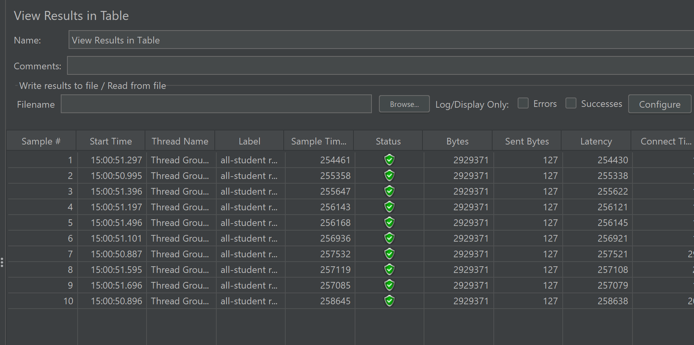
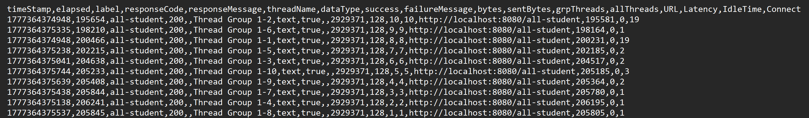
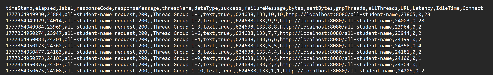

Before Optimization:
/all-student:

/all-student-name:

/highest gpa:

Command line before optimization:

student name:

highest gpa:

After optimization:

After the profiling and performance optimization process is completed, perform a
performance test again using JMeter, see the results, and compare with the first
measurement. Is there an improvement from JMeter measurements? Write your
conclusion in the README.md file.

Bisa dilihat di before dan after ada improvement yang signifikan 
Peningkatan paling signifikan terjadi pada endpoint `/all-student`, 
karena sebelumnya terjadi masalah **N+1 query**, di mana aplikasi melakukan query berulang untuk setiap student. 
Setelah dioptimasi menggunakan `JOIN FETCH`, jumlah query berkurang drastis sehingga waktu eksekusi menjadi lebih cepat.
Pada endpoint `/all-student-name`, performa meningkat karena penggunaan operasi concatenation string yang sebelumnya tidak efisien 
telah diganti dengan metode yang lebih optimal.
Sedangkan pada endpoint `/highest-gpa`, performa meningkat karena proses pencarian nilai GPA 
tertinggi yang sebelumnya dilakukan di memori aplikasi, kini langsung ditangani oleh database menggunakan query yang lebih efisien.
Secara keseluruhan, optimasi yang dilakukan berhasil meningkatkan performa aplikasi dengan penurunan waktu respon yang signifikan berdasarkan hasil pengujian JMeter.

1. What is the difference between the approach of performance testing with JMeter and
   profiling with IntelliJ Profiler in the context of optimizing application performance?

Perbedaan utama antara performance testing dengan JMeter dan profiling dengan IntelliJ Profiler adalah fokus analisisnya.
JMeter digunakan untuk mengukur performa aplikasi dari sisi eksternal, seperti response time, throughput, dan kemampuan menangani banyak request secara bersamaan (simulasi user). Jadi, JMeter membantu mengetahui seberapa cepat dan stabil aplikasi dari sudut pandang pengguna.
Sedangkan IntelliJ Profiler digunakan untuk menganalisis performa dari sisi internal aplikasi, seperti penggunaan CPU, method mana yang paling lama dieksekusi, dan bottleneck dalam kode. Profiler membantu mengidentifikasi bagian kode mana yang perlu dioptimasi.
Kesimpulannya, JMeter menunjukkan "seberapa lambat atau cepat aplikasi", sedangkan Profiler menunjukkan "kenapa aplikasi tersebut lambat" ya dari sisi kode.

2.How does the profiling process help you in identifying and understanding the weak points
in your application?

Profiling membantu mengidentifikasi dan memahami titik lemah aplikasi dengan menampilkan penggunaan resource secara detail, seperti CPU time dan pemanggilan method.
Dengan profiling, kita bisa melihat method mana yang paling sering dipanggil atau memakan waktu paling lama (hotspot). Dari situ, kita dapat mengetahui bagian kode yang menjadi bottleneck, misalnya loop yang tidak efisien atau query database yang berulang (N+1 problem).
Dengan informasi tersebut, kita dapat melakukan optimasi secara tepat sasaran karena kita tahu secara jelas bagian mana yang menyebabkan performa aplikasi menurun.

3. Do you think IntelliJ Profiler is effective in assisting you to analyze and identify
   bottlenecks in your application code?
Ya, IntelliJ Profiler sangat efektif dalam membantu menganalisis dan mengidentifikasi bottleneck pada aplikasi. Dengan profiler, kita dapat melihat penggunaan CPU, waktu eksekusi setiap method, serta call hierarchy secara detail. Hal ini memudahkan untuk menemukan bagian kode yang paling memakan waktu (hotspot) dan memahami alur eksekusi aplikasi. Dengan begitu,
proses optimasi menjadi lebih terarah karena kita tidak perlu menebak-nebak, melainkan berdasarkan data yang konkret.
apalagi jika kodenya semakin besar kayak grab atau gojek
4. What are the main challenges you face when conducting performance testing and
   profiling, and how do you overcome these challenges?
Challenge utama adalah kita harus ada intelij ultimate untuk setup profilling dan juga kita harus 
tunggu lama untuk data seeding solusinya adalah membaca dokumentasi dari web dan juga bantuan ai 
agar lebih cepat kita bisa akses dan meneyelsaikan data seediing
5. What are the main benefits you gain from using IntelliJ Profiler for profiling your
   application code?
Manfaat utama dari penggunaan IntelliJ Profiler adalah kemampuannya memberikan insight yang detail terhadap performa aplikasi secara internal. Profiler membantu mengidentifikasi method yang paling banyak menggunakan CPU, menemukan bottleneck, serta memahami alur eksekusi melalui call hierarchy.
Selain itu, profiler juga memudahkan proses analisis karena data ditampilkan secara visual dan terstruktur, sehingga lebih mudah dibandingkan menebak berdasarkan log. Dengan informasi tersebut, optimasi dapat dilakukan secara lebih tepat dan efisien.
6. How do you handle situations where the results from profiling with IntelliJ Profiler are not
   entirely consistent with findings from performance testing using JMeter?
Ketika hasil profiling dari IntelliJ Profiler tidak sepenuhnya konsisten dengan hasil performance testing dari JMeter, saya akan menganalisis keduanya dari perspektif yang berbeda. JMeter mengukur performa dari sisi eksternal (response time dan beban user), sedangkan Profiler menganalisis dari sisi internal (CPU usage dan bottleneck kode).
Saya akan memastikan kondisi pengujian konsisten (jumlah request, warm-up, dan data), lalu menggunakan JMeter untuk mengidentifikasi endpoint yang lambat, dan Profiler untuk mencari penyebab internalnya. Jika terdapat perbedaan, 
kemungkinan disebabkan oleh faktor lain seperti jaringan, I/O, atau database. Dengan menggabungkan kedua hasil tersebut, saya bisa mendapatkan pemahaman yang lebih lengkap dan akurat terhadap performa aplikasi.

7.What strategies do you implement in optimizing application code after analyzing results
from performance testing and profiling? How do you ensure the changes you make do
not affect the application's functionality?

Strategi yang saya lakukan setelah menganalisis hasil performance testing dan profiling adalah fokus pada bottleneck yang teridentifikasi, seperti mengurangi jumlah query (misalnya mengatasi N+1 problem dengan JOIN FETCH), mengoptimalkan operasi di memori (seperti mengganti string concatenation dengan StringBuilder), dan memindahkan proses berat ke database jika lebih efisien.
Untuk memastikan perubahan tidak mempengaruhi fungsionalitas, saya melakukan pengujian ulang pada endpoint yang sama dan membandingkan hasilnya dengan sebelumnya. Selain itu, saya juga memastikan output tetap konsisten dan sesuai dengan yang diharapkan. Dengan demikian, optimasi yang dilakukan hanya meningkatkan performa tanpa mengubah perilaku aplikasi.

